# Enterprise AI Chat Interface (Chainlit Frontend)


## 📋 Executive Summary

This repository contains a robust, asynchronous chat interface built with **Chainlit**. It is designed to serve as a secure frontend orchestrator between end-users and a proprietary **AI Middleware**.

The solution is engineered to handle **Customer Service** workflows (e.g., Order Tracking, Returns, General Inquiries) with a focus on **high concurrency**, **state management**, and **user experience (UX)**.

## Key Features

- ⚡ **Asynchronous Architecture:** Utilizes `httpx` and `asyncio` for non-blocking I/O, ensuring high throughput and low latency compared to traditional synchronous requests.
- 🧠 **Session State Management:** Implements persistent conversation history within the user session, allowing the AI to maintain context (memory) across multiple interactions.
- 🔒 **Security by Design:** Strict separation of configuration and code via Environment Variables. No sensitive URLs or API keys are hardcoded.
- ✨ **Optimistic UI & UX:** Features transitional states ("Thinking...", "Connecting to Specialist...") to manage user expectations and reduce perceived latency.
- ⚙️ **Configurable Persona:** The bot's name, role, and welcome message are fully customizable via environment variables without touching the codebase.

## 📊 System Diagrams

### High-Level Architecture

The application acts as a stateless frontend layer that forwards user intent and history to a backend logic tier.

```mermaid
graph LR
    User("👤 End User") <-->|WebSocket| CL["🖥️ Chainlit App<br/>(Frontend)"]
    CL <-->|Async HTTP/JSON| MW["🧠 AI Middleware<br/>(Backend)"]

    subgraph "Frontend Layer"
        CL
        SS[("📦 Session<br/>Storage")]
        CL <--> SS
    end

    subgraph "Backend Infrastructure"
        MW
        AI["🤖 AI Models"]
        MW <--> AI
    end

    style User fill:#e1f5fe
    style CL fill:#c8e6c9
    style MW fill:#fff3e0
```



### Message Flow Sequence

```mermaid
sequenceDiagram
    autonumber
    participant U as 👤 User
    participant CL as 🖥️ Chainlit
    participant S as 📦 Session
    participant MW as 🧠 Middleware

    rect rgb(230, 245, 255)
        Note over CL: Chat Initialization
        CL->>CL: Validate ENV Variables
        alt Missing Config
            CL-->>U: ⚠️ System Error
        else Config Valid
            CL->>S: Initialize Empty History
            CL-->>U: 👋 Welcome Message
        end
    end

    rect rgb(255, 243, 224)
        Note over U,MW: Message Processing Loop
        U->>CL: Send Message
        CL->>S: Store User Message
        CL-->>U: 🧠 "Thinking..."
        
        CL->>MW: POST {message, history}
        
        alt HTTP 200 OK
            MW-->>CL: {response, category}
            
            alt Specialized Category
                CL-->>U: 🔄 "Connecting to Specialist..."
                CL->>CL: ⏳ Wait 2s (UX Delay)
            else General Category
                CL->>CL: Remove Status Message
            end
            
            CL-->>U: 💬 AI Response
            CL->>S: Store Assistant Response
            
        else HTTP Error
            CL-->>U: ⚠️ Service Unavailable
        else Timeout (45s)
            CL-->>U: ⚠️ Timeout Error
        else Connection Failed
            CL-->>U: ⚠️ Connection Error
        end
    end
```


### Request Processing Flowchart

```mermaid
flowchart TD
    A([📨 User Message Received]) --> B[Update Session History<br/>with User Message]
    B --> C[Display Status:<br/>'🧠 Thinking...']
    C --> D[Prepare JSON Payload<br/>& Auth Headers]
    D --> E{Async POST<br/>to Backend API}
    
    E -->|✅ Status 200| F[Parse JSON Response]
    E -->|❌ Status 4xx/5xx| G[/"⚠️ Service Unavailable"/]
    E -->|⏱️ Timeout 45s| H[/"⚠️ Timeout Error"/]
    E -->|🔌 Network Error| I[/"⚠️ Connection Error"/]
    
    F --> J{Check Response<br/>Category}
    
    J -->|Specialized<br/>Orders/Returns/etc| K[Update Status:<br/>'🔄 Connecting to Specialist...']
    J -->|General or<br/>AccountProfileOther| L[Remove Status<br/>Message]
    
    K --> M[⏳ Transition Delay<br/>2 seconds]
    M --> N
    L --> N[Send AI Response<br/>to User]
    
    N --> O[Update Session History<br/>with Assistant Response]
    O --> P([✅ Ready for Next Message])
    
    G --> P
    H --> P
    I --> P

    style A fill:#e3f2fd
    style P fill:#c8e6c9
    style G fill:#ffcdd2
    style H fill:#ffcdd2
    style I fill:#ffcdd2
```


### Application State Diagram

```mermaid
stateDiagram-v2
    [*] --> Initializing: on_chat_start

    Initializing --> ConfigError: Missing ENV Variables
    Initializing --> Ready: ✅ Config Valid

    ConfigError --> [*]: Session Ends
    
    Ready --> Processing: User Message Received
    
    Processing --> Specialist: Category = Specialized
    Processing --> GeneralResponse: Category = General
    Processing --> ErrorState: API Failure
    
    Specialist --> TransitionDelay: Show "Connecting..."
    TransitionDelay --> Responding: After 2s
    
    GeneralResponse --> Responding: Immediate
    
    Responding --> Ready: ✅ Response Sent
    
    ErrorState --> Ready: ⚠️ Error Displayed

    note right of Processing
        Async HTTP Request
        with 45s Timeout
    end note

    note right of Specialist
        Categories like:
        - OrderTracking
        - Returns
        - ProductInquiry
    end note
```


### Component Interaction


### Error Handling Flow

```mermaid
flowchart LR
    subgraph "Request Phase"
        REQ[HTTP Request] --> |Try| SEND[Send to Backend]
    end
    
    subgraph "Response Handling"
        SEND --> |200| OK[✅ Process Response]
        SEND --> |4xx/5xx| ERR1[❌ HTTP Error]
        SEND --> |TimeoutException| ERR2[⏱️ Timeout]
        SEND --> |Exception| ERR3[🔌 Connection Error]
    end
    
    subgraph "User Feedback"
        OK --> |Success| RESP[💬 Show AI Response]
        ERR1 --> |Log + Display| MSG1["⚠️ Service Unavailable"]
        ERR2 --> |Log + Display| MSG2["⚠️ Timeout Message"]
        ERR3 --> |Log + Display| MSG3["⚠️ Connection Error"]
    end

    style OK fill:#c8e6c9
    style ERR1 fill:#ffcdd2
    style ERR2 fill:#ffcdd2
    style ERR3 fill:#ffcdd2
```


## 🚀 Getting Started

### Prerequisites

- Python 3.9 or higher
- `pip` (Python Package Manager)
- A running instance of the AI Middleware (Backend)

### 1. Installation

Clone the repository and navigate to the project directory:

```bash
git clone https://github.com/hitthecodelabs/EnterpriseAICchat-Chainlit.git
cd EnterpriseAICchat-Chainlit
```

Create a virtual environment:

```bash
# MacOS/Linux
python3 -m venv venv
source venv/bin/activate

# Windows
python -m venv venv
.\venv\Scripts\activate
```

Install dependencies:

```bash
pip install -r requirements.txt
```

### 2. Configuration

Create a `.env` file in the root directory. You can use the provided example as a template:

```bash
cp .env.example .env
```

Required Variables:

| Variable           | Description                         | Example                          |
|-------------------|-------------------------------------|----------------------------------|
| `BACKEND_API_URL` | Endpoint of your AI Middleware      | `https://api.yourcompany.com/chat` |
| `BACKEND_API_SECRET` | Secure key to authenticate requests | `sk_prod_12345...`               |
| `BOT_NAME`        | Name displayed to the user          | `Maria S.`                       |
| `BOT_ROLE`        | Role description in welcome message | `Support Specialist`             |

### 3. Usage

Run the application locally with hot-reloading enabled:

```bash
chainlit run app.py -w
```

The interface will be available at: `http://localhost:8000`.

## 🛠 Project Structure

```text
├── .env.example       # Template for environment variables (Safe to commit)
├── .gitignore         # Ignores .env and venv (Security best practice)
├── app.py             # Main application logic (Async & Stateful)
├── chainlit.md        # Chainlit welcome markdown (Optional)
├── requirements.txt   # Project dependencies
└── README.md          # Project documentation
```

## 📦 Deployment (Production)

For production environments (e.g., Railway, AWS ECS, Docker), ensure the start command is configured to run headless:

```bash
chainlit run app.py --host 0.0.0.0 --port 8000 --headless
```

### Docker Support

This project is Docker-ready. Ensure you pass the environment variables defined in `.env` securely through your container orchestration platform secrets manager.

## 🛡 Disclaimer

This software is provided "as is", without warranty of any kind. It is intended as a frontend template and requires a functioning backend API to process natural language queries.

## 📝 Consultant Notes for Implementation

- **Customization:** Edit the `Config` class in `app.py` or update your `.env` file to change the bot's behavior.
- **Logging:** The application uses Python's standard `logging` library. In a production environment, ensure these logs are piped to a monitoring tool like Datadog or CloudWatch.
